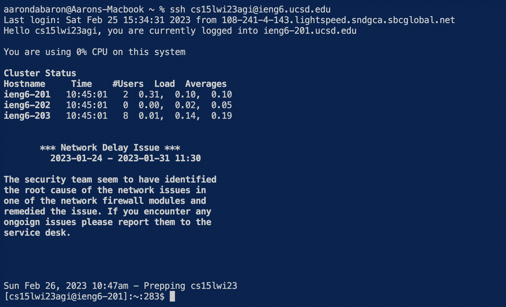

# CSE 15L Lab Report 4 - CSE Tasks done quick
## Aaron Arellano

# Competition tasks

The following tasks are a recreation of the competition tasks done during lab in the seventh week of the quarter. The steps will begin starting at step 4.
The first step was to delete any forks of the /lab7 repository before starting a new timed round. Step 2 was to setup a brand new fork of the repository 
and step 3 is was to begin the timer.

# Step #4 - Logging into the ieng6 ucsd server

The first step was to login into the ieng6 ucsd server.



To get through this step, I wrote the following in the terminal.
```
ssh cs15lwi23agi@ie<tab><enter>
```
The command is used to login into the ucsd ieng6 server. I started off by writing out the ssh and the beginning of the ucsd course email, the *tab* 
press autocompleted the email and made it so it read **cs15lwi23agi@ieng6.ucsd.edu**. The *enter* command finished the command and sent it to the terminal,
creating the output seen in the picture.

# Step #5 - Cloning the fork of the /lab7 repository

The fifth step was to clone the fork of the lab7 repository repository found within my github account.


To get through this step, I first went to the fork located within my github account and copied the ssh url under the *code* button. Afterwards, i went back
to the terminal and write out the following
 ```
 git clo<tab> <cmd><v><enter>
 ```
The command is used to copy the lab7 repository into the current working directory. I started by writing git and clo, the first *tab*  press was used to
autocomplete the **clone** phrase. After a space, I pressed the *command* key and the *v* key at the same time to paste the ssh url of the repository
I copied from my github account earlier. I then pressed enter to complete the command.

# Step #6 - Run the JUNIT tests and show their failure

The next step was to run the junit tests located within the ListExamplesTests.java file located in the lab7 repository I cloned. I needed to demonstrate
that one of the tests in the file failed.


The first step that I took was to change my current directory to the lab7 repository I cloned. To get through that, I wrote the following
```
cd la<tab><enter>
```
I wrote the cd (change directory) command and wrote la, pressing *tab* afterwards to complete the name of the repository.
The next step was to compile and run the junit tests in the ListExamplesTests file. To run those, I pressed the following,
```
<up><up><up><up><up><enter>
<up><up><up><up><up><enter>
```
The commands I used were to first compile Junit, and then run the tests in the file. I pressed the up arrow key five times because I had the line 
javac -cp .:lib/hamcrest-core-1.3.jar:lib/junit-4.13.2.jar *.java* (compiles) five lines up in my terminal history, therefore I used the arrows to get to it. Similarly to get to the line java -cp .:lib/hamcrest-core-1.3.jar:lib/junit-4.13.2.jar org.junit.runner.JUnitCore ListExamplesTests (Runs file), It was 5 lines up in my terminal history, so I used the arrow keys to get to it. I pressed enter to enter the command. As we can see from the picture, the junit file concluded that one test had failed.

# Step 7 - Edit the code file to fix the failing test

The next task was to review the ListExamples file and fix whatever was causing the error and the failing output from junit. 


From previously looking over the file, I concluded that the error was located at line 43, where index1 was incremented instead of index 2.
The first step I took was writing the following,
```
nano ListE<tab>ja<tab>
```
The line above opened the nano editor to edit the ListExamples.java file. I first wrote nano, and then ListE<tab>, where the *tab* autocompleted the name
of the file up to the period. I then wrote ja and pressed *tab*, which autocompleted the java part of the file name. After the nano tab was opened for the
ListExamples.java file, I used the following commands.
  
```
<ctrl><w> while(index2 < list2.size()<enter>
<down><down><right><right><right><right><right><right><backspace><2>
<ctrl><o><enter>
<ctrl><x>
```
I knew the while loop where the typo was, so I pressed *ctrl* and W for the **Where Is** command. I then typed out the beginning of the loop and pressed enter, there the nano editor automatically brought me down to the incorrect loop. To get to exactly where the typo was, I used the down and right arrow keys. Once i was at the index1 word, I used backspace to get rid of the 1 and input the correct number 2. To save the change, I pressed *ctrl* and O for the **write out** command. To exit out of the nano page and return to the terminal, I pressed *ctrl* and x.

# Step 8 - Run the JUNIT tests and demonstrate their success
  
The next step was to run the junit tests in the ListExamplesTests.java file after debugging the ListExamples.java file.
  

  
The steps to complete this task are similar to those that I used to initially check the tests before the debugging. I wrote the following in the terminal,
```
<up><up><up><up><up><enter>
<up><up><up><up><up><enter>
```

To get to the javac -cp .:lib/hamcrest-core-1.3.jar:lib/junit-4.13.2.jar *.java* line to compile, It was already in my terminal history 5 lines up, so I used the up arrow key five times to get to it and pressed enter. To get to the java -cp .:lib/hamcrest-core-1.3.jar:lib/junit-4.13.2.jar org.junit.runner.JUnitCore ListExamplesTests line to run the tests, I used the up arrow 5 times to reach it, as it was also 5 lines up in my terminal history. After pressing enter, we can see that both tests run successfully, as shown in the screenshot.

# Step 9 - Commiting and pushing the change to github
 
The final step of the competition was to commit and push the change we made to the ListExamples.java file to our github account where we copied the repository in the first place. 


To successfully push and commit the changes to github, I used the following keys,

```
git add Li<tab>ja<tab>
git com<tab> -m "ListExamples updated"
```
For the first line, I wrote git and then add (to push the new changed file), then wrote Li, pressing *tab* afterwards. The tab autocompleted the name of the file (ListExamples) up to the point. Afterwards I just typed ja, then pressed *tab* to autocomplete the java at the end of the filename. To commit the changes to github, I wrote git com, and pressed *tab* to autocomplete the commit command. Afterwards I wrote -m and a message letting github know of the specific change. The git add command adds the new updated file to the original repository (updates the original) and the commit command finalizes the changes to the new updated file. After these two commands, the file should now contain the line index2 on github, which now ensures that the program is completely functional for use.

After the changes have been saved on github, the competition tasks have ended.
  
  

  


